# 🚲 UrbanRoll Bike-Sharing Data Analysis (BigQuery SQL)

## 📌 Project Overview
UrbanRoll is a city-based bike-sharing service. This project analyzes **15,000+ ride records** using **Google BigQuery (SQL)** to uncover operational patterns, user behavior, growth trends, and system inefficiencies.

The analysis focuses on answering **business-critical questions** such as:
- When do users ride the most?
- How do subscribers differ from casual riders?
- Which stations frequently run out of bikes?
- Is the business growing, and are users being retained?

This project follows a **real-world analytics workflow**
> *Data Analysis with SQL using BigQuery*  

---

## 🧰 Tech Stack
- **SQL (Standard SQL)**
- **Google BigQuery**
- **CTEs & Window Functions**
- **Aggregations & Time-Series Analysis**
- **Data Visualization (Screenshots)**

---

## 🔍 Data Quality Checks

Before analysis, several validation checks were performed:

### Null Value Detection
Identified missing values across ride duration, station names, and timestamps.

### False Starts
Detected and excluded rides with unrealistic durations (e.g., negative or near-zero time).

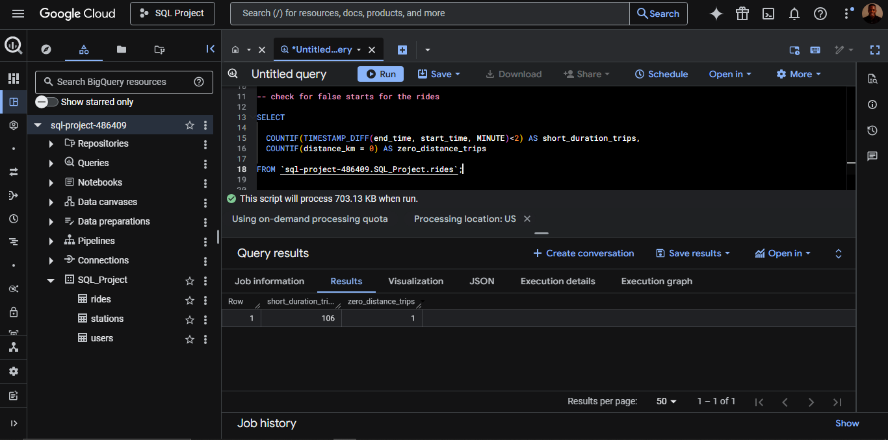

---

## 📊 Exploratory Analysis

### Dataset Overview
- **Total Rides**
- **Total Users**
- **Total Stations**
- **Membership Distribution**

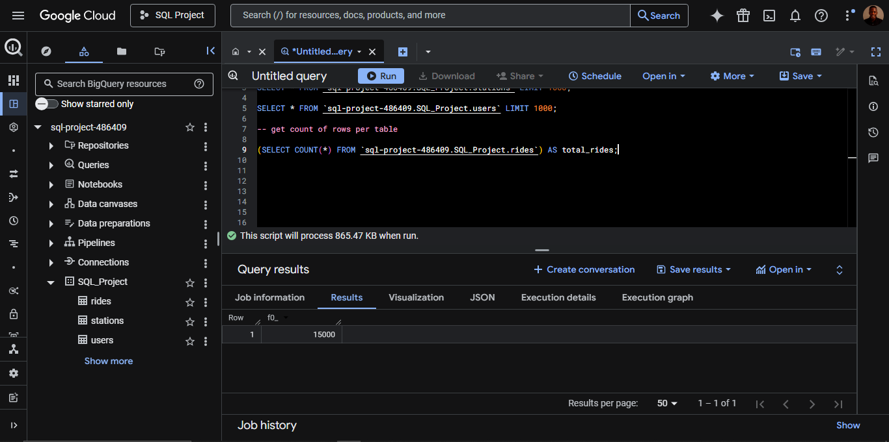
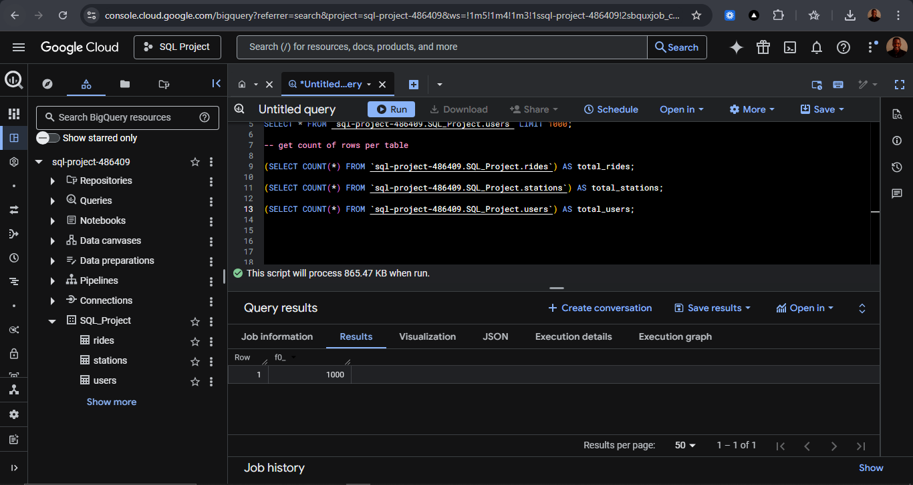
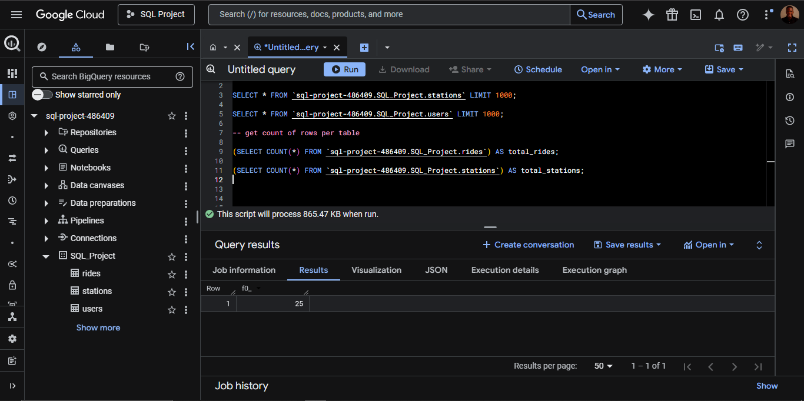

---

## ⏰ Peak Usage Analysis (Operational Pulse)

UrbanRoll exhibits a **clear double-hump demand pattern**, confirming its role as a **commuter-first service**.

### Key Observations
- Morning peak: **~7:00 AM**
- Afternoon peak: **~3:00 PM**
- Usage drops significantly between **10:00 AM – 2:00 PM**

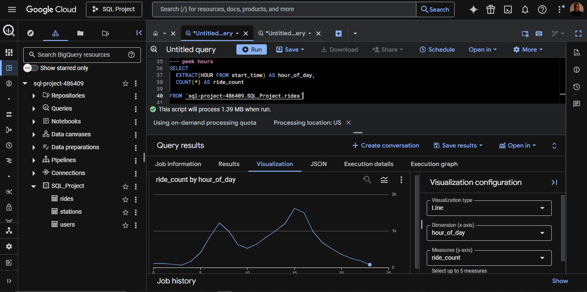

### 📌 Recommendation
Deploy **bike rebalancing crews between 10 AM and 2 PM**, when demand is lowest, to prepare stations for peak commuting hours.

---

## 👥 User Segmentation: Subscribers vs Casual Riders

The analysis reveals **two distinct user personas**:

### 🚴 Subscriber (Commuter)
- Short, predictable trips
- Average ride duration: **~15 minutes**
- High frequency
- Backbone of daily ride volume

### 🌍 Casual User (Explorer)
- Longer, irregular trips
- Average ride duration: **~35 minutes**
- Lower frequency but higher total bike usage time

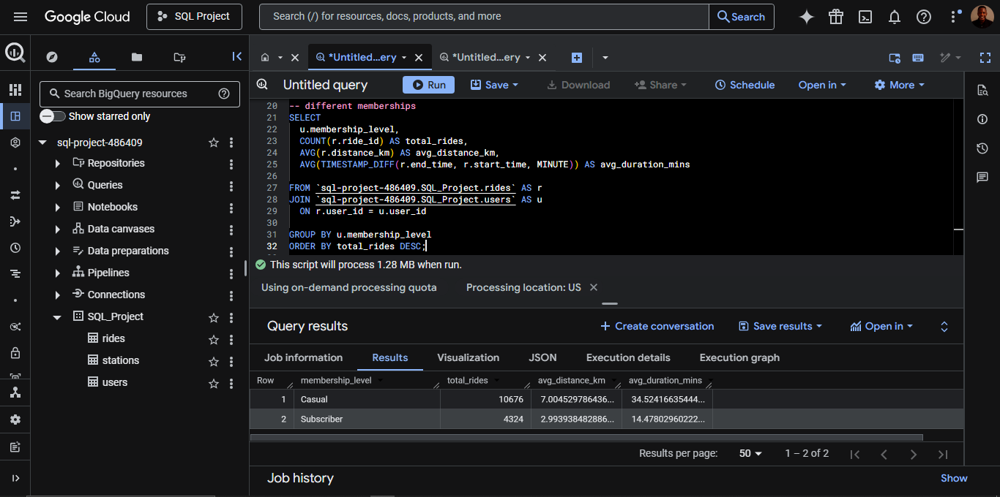

### 📌 Recommendation
Introduce a **“Weekend Explorer Pass”** targeted at casual riders to increase ride frequency during off-peak hours.

---

## 📍 Station Performance & Popularity

### Most Popular Stations
Identified high-traffic stations frequently used as start or end points.

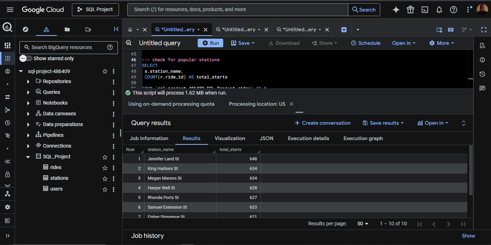
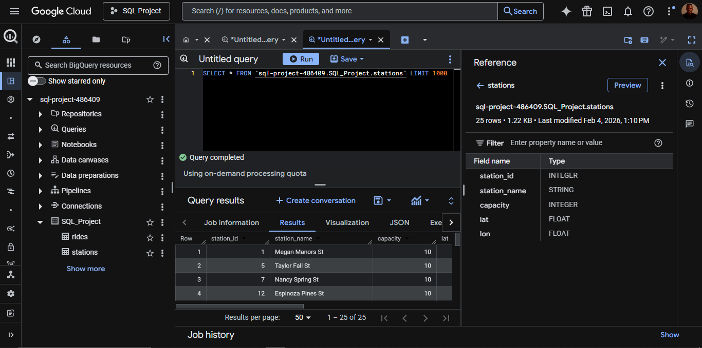

---

## 🔄 Rebalancing Crisis (Advanced Insight)

Using a **Net Flow CTE**, stations were classified as:

- **Sinks** → accumulate too many bikes  
- **Sources** → frequently run out of bikes

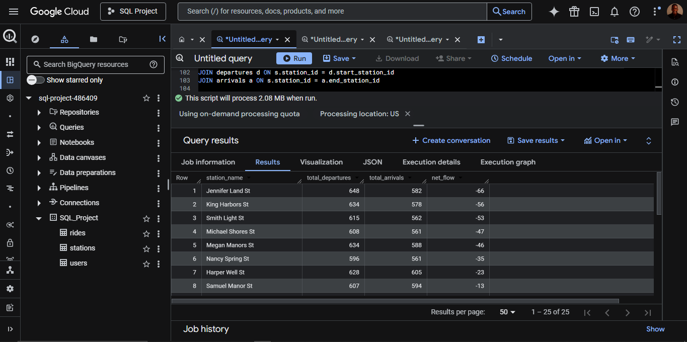

### Key Insight
- **Top Sink Station** 
- **Top Source Station**

### 📌 Recommendation
Implement **dynamic incentives**:
- Offer small discounts or credits to users who end rides at **source stations**
- Reduces operational rebalancing costs while improving availability

---

## 📈 Growth & User Retention Analysis

### Month-over-Month Growth
- Consistent upward trend in total rides and users
- Growth remains positive after smoothing with a **7-day moving average**

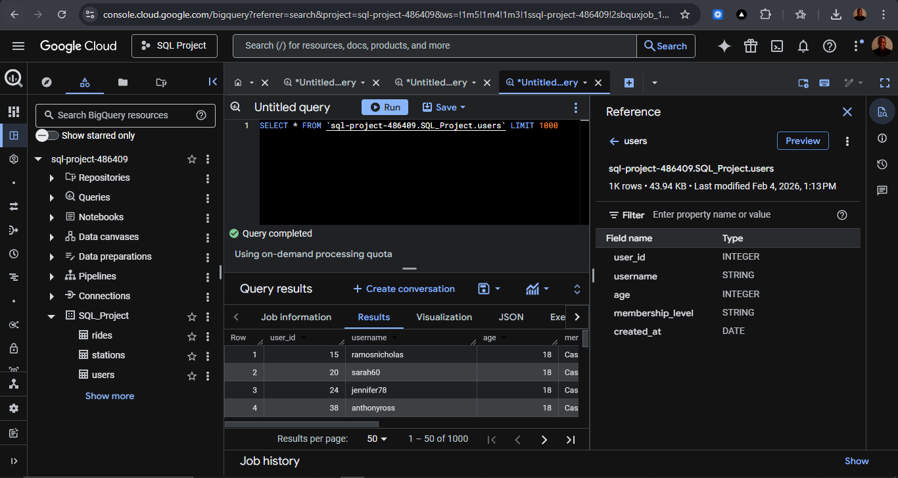
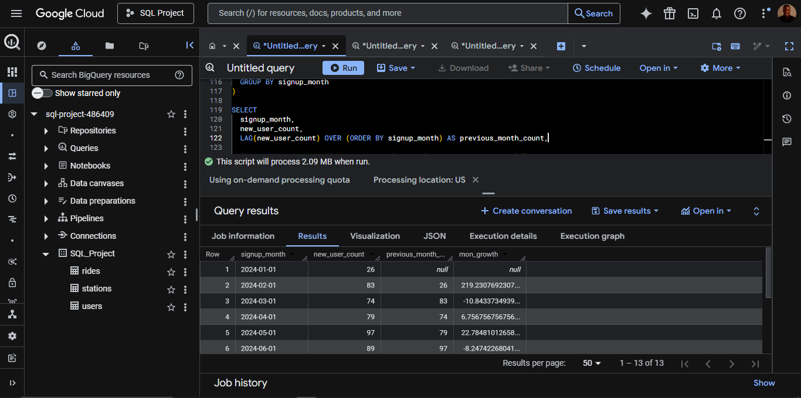

### Power User Insight
- The **top 1% of users** contribute a disproportionate share of total rides and revenue
- Indicates strong engagement but potential dependency risk

### 📌 Recommendation
- Introduce **loyalty rewards** or **premium tiers** to retain power users
- Reduce churn risk by diversifying revenue sources

---

## 📊 Summary Statistics

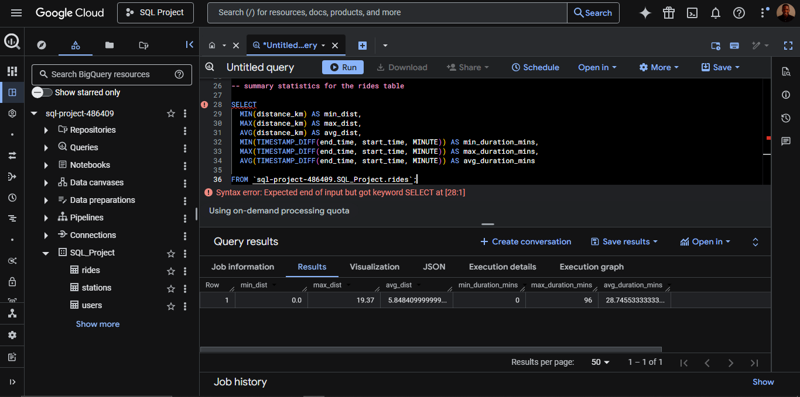

---

## 📄 SQL Script
All queries used in this analysis are available in BigQuery Folder

The script includes:
- Data cleaning
- CTE-based transformations
- Window functions
- Time-series aggregation
- Net flow station analysis
- Retention & growth metrics

---

## 🎯 Final Business Takeaways
- UrbanRoll is fundamentally a **commuter-driven platform**
- Strategic rebalancing timing can reduce operational strain
- Casual riders represent a **growth opportunity**
- Station-level incentives can replace costly logistics
- Retention strategies should prioritize **high-value power users**

---

## 📌 Author
**Fred Kibutu**  
Data Analyst | Data Engineer | Software Engineer

---

## ⭐ If you found this project insightful
Give the repository a ⭐ and feel free to fork or contribute!

---
